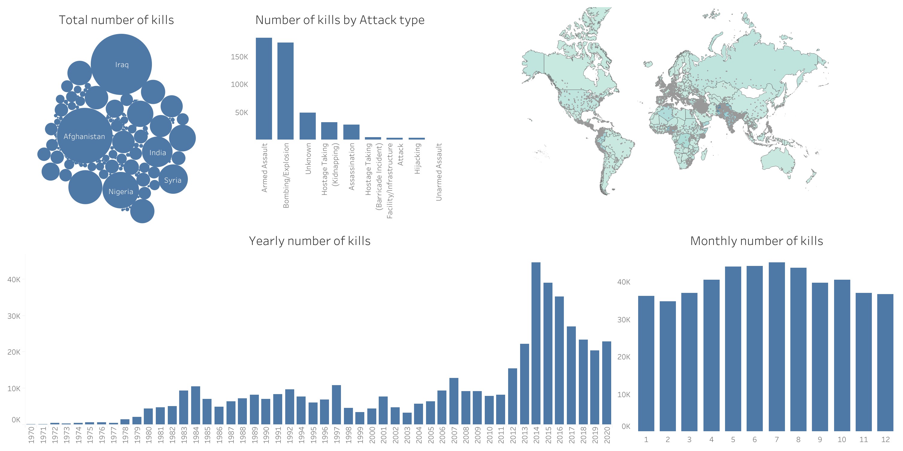
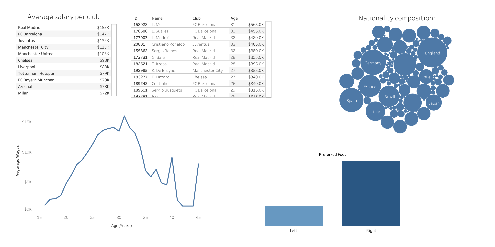
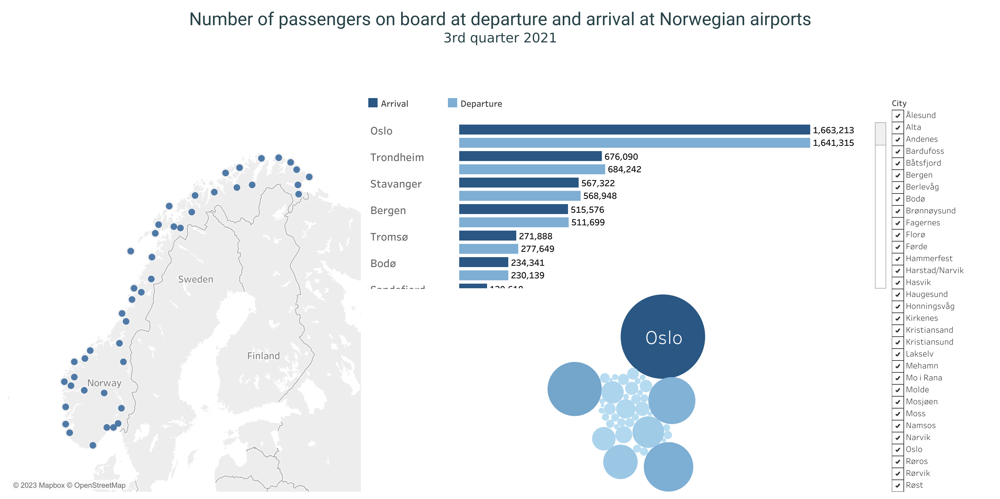

# Data Visualization Showcase

This repository is a demonstration of my data visualization skills using Tableau. The visualizations cover various datasets, showcasing a range of analytical and visualization techniques.

## Purpose

The main goal of this repository is to exhibit my expertise in data visualization, from understanding data sources to creating insightful and interactive Tableau dashboards. Whether you're a fellow data enthusiast, potential collaborator, or employer, I hope these visualizations provide a clear picture of my capabilities.

## Datasets and Visualizations

### 1. Global Terrorism Data (GTD) (1970-2020)

- **Data Source**: `data/Global Terrorism Data (GTD) (1970-2020).xlsx`
- **Tableau Workbook**: `terror_dataset_b.twbx`
- **Dashboard Screenshot**: 

- **Interactive Dashboard**: [Tableau Public - Terrorism Data](https://public.tableau.com/shared/XQ4XZDNXJ?:display_count=n&:origin=viz_share_link)

### 2. Players Data

- **Data Source**: `data/players.csv`
- **Tableau Workbook**: `player_dataset.twbx`
- **Dashboard Screenshot**: 

- **Interactive Dashboard**: [Tableau Public - Players Data](https://public.tableau.com/views/Book1_16387397028890/Dashboard1?:language=en-US&:display_count=n&:origin=viz_share_link)

### 3. Passengers Data

- **Data Source**: `data/passagers.csv`
- **Tableau Workbook**: `passenger_dataset.twbx`
- **Dashboard Screenshot**: 

- **Interactive Dashboard**: [Tableau Public - Passengers Data](https://public.tableau.com/views/week4_lab/Dashboard1?:language=en-US&:display_count=n&:origin=viz_share_link)

## Data Privacy

Please note that all datasets used in this repository are for demonstration purposes only. Any resemblance to real data is purely coincidental. Always ensure no sensitive or private information is present in datasets when sharing.

## Collaboration and Feedback

Your feedback is invaluable! Whether it's a tip, suggestion, or potential collaboration opportunity, feel free to raise issues or submit pull requests.

